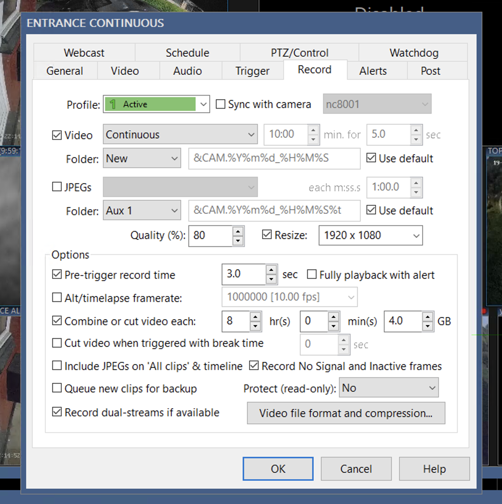
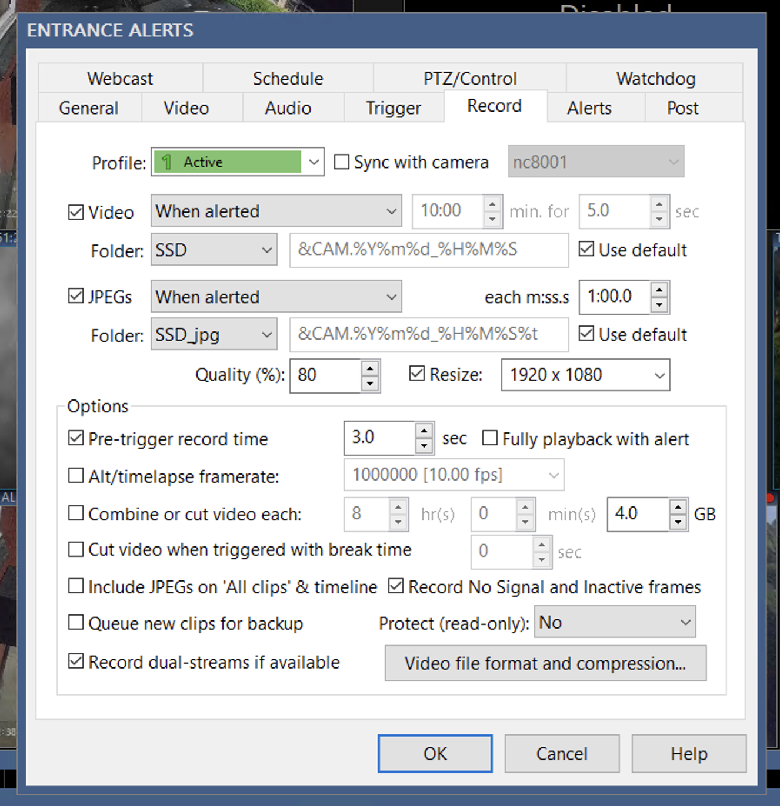
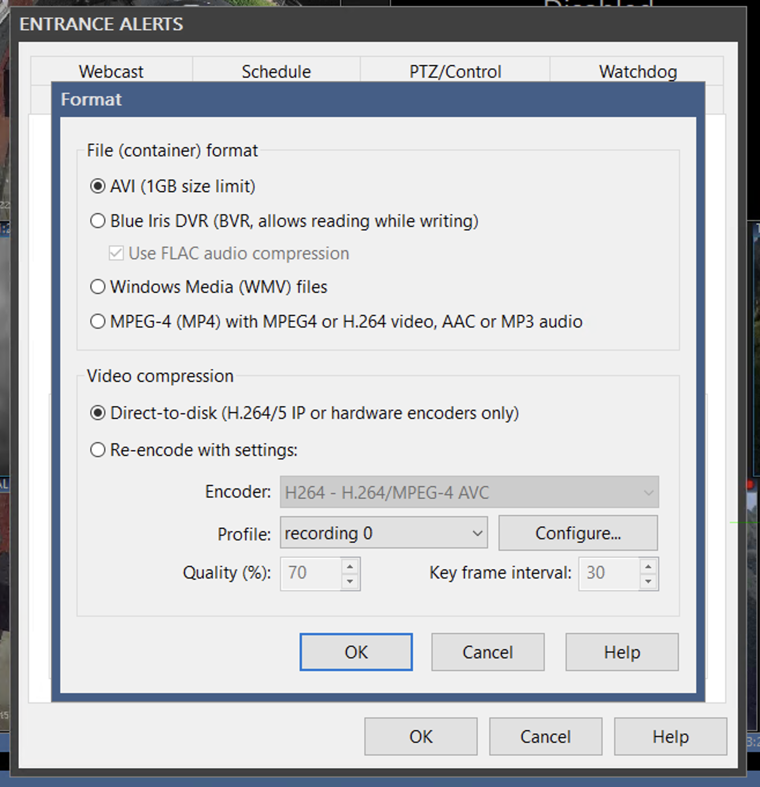
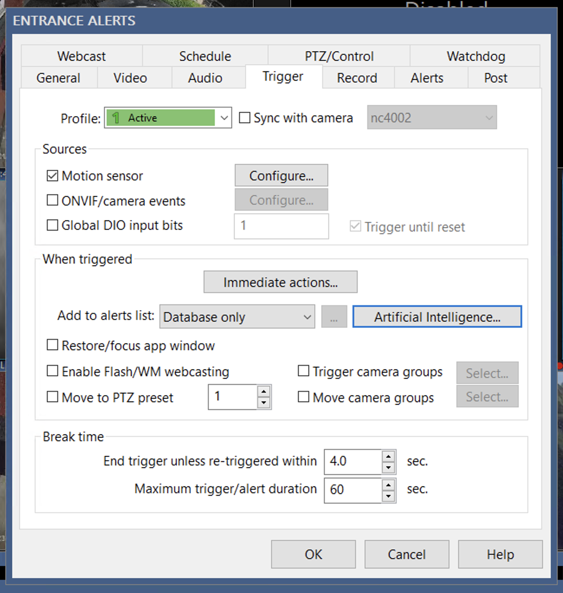
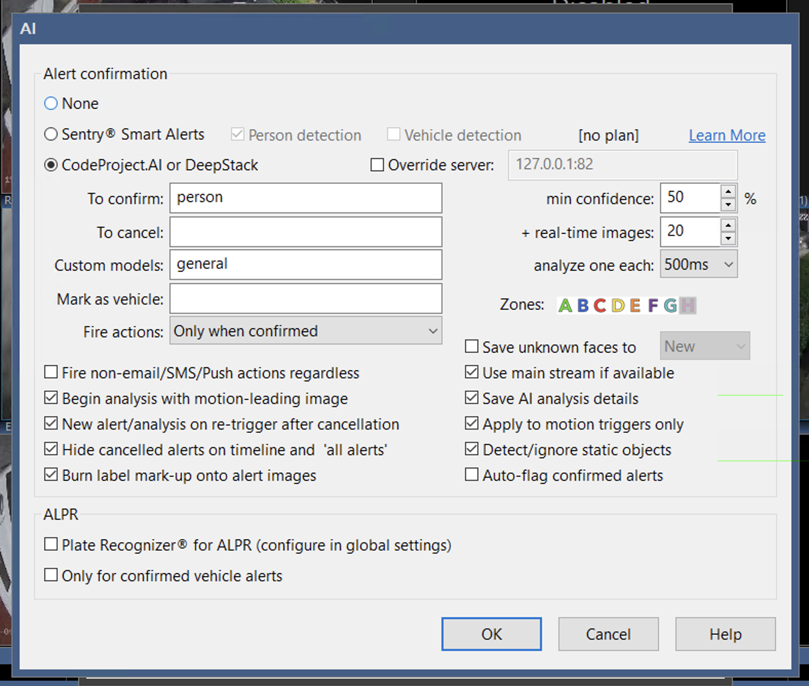
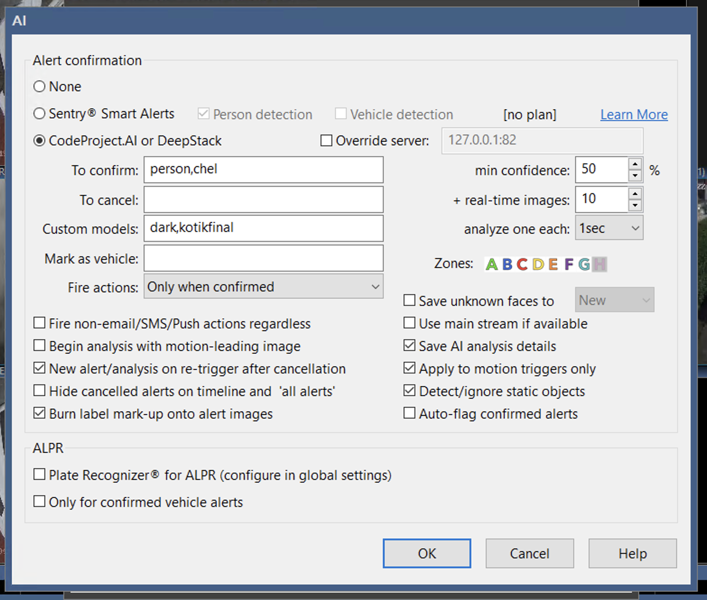
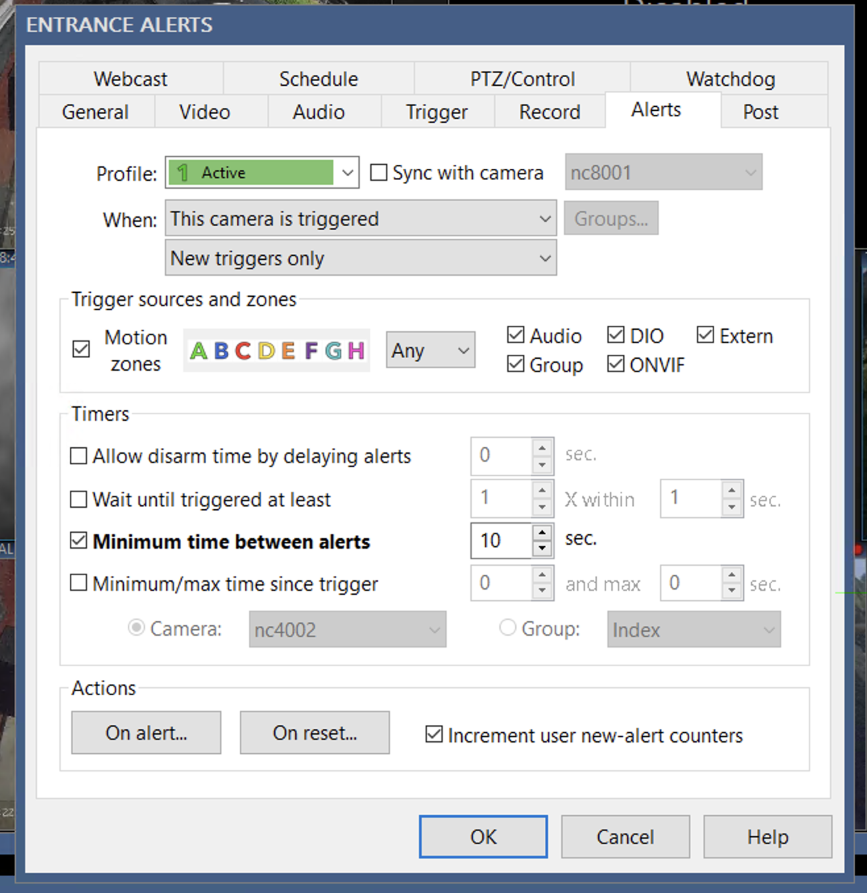
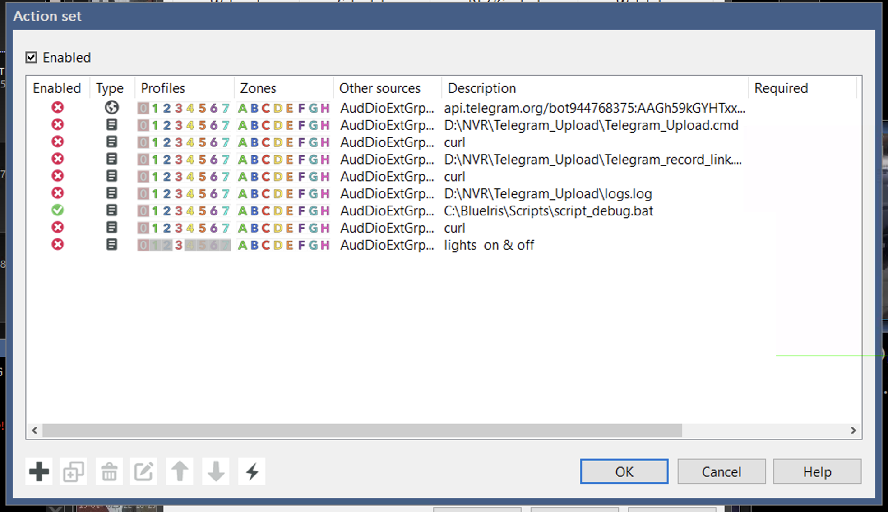
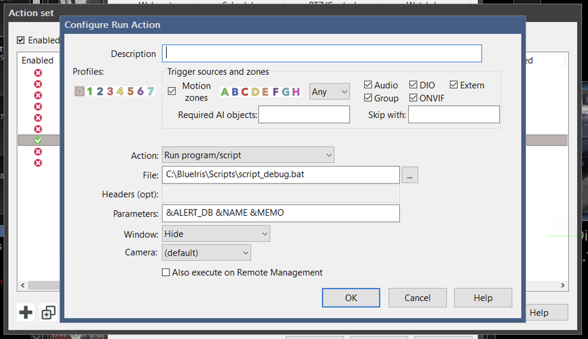
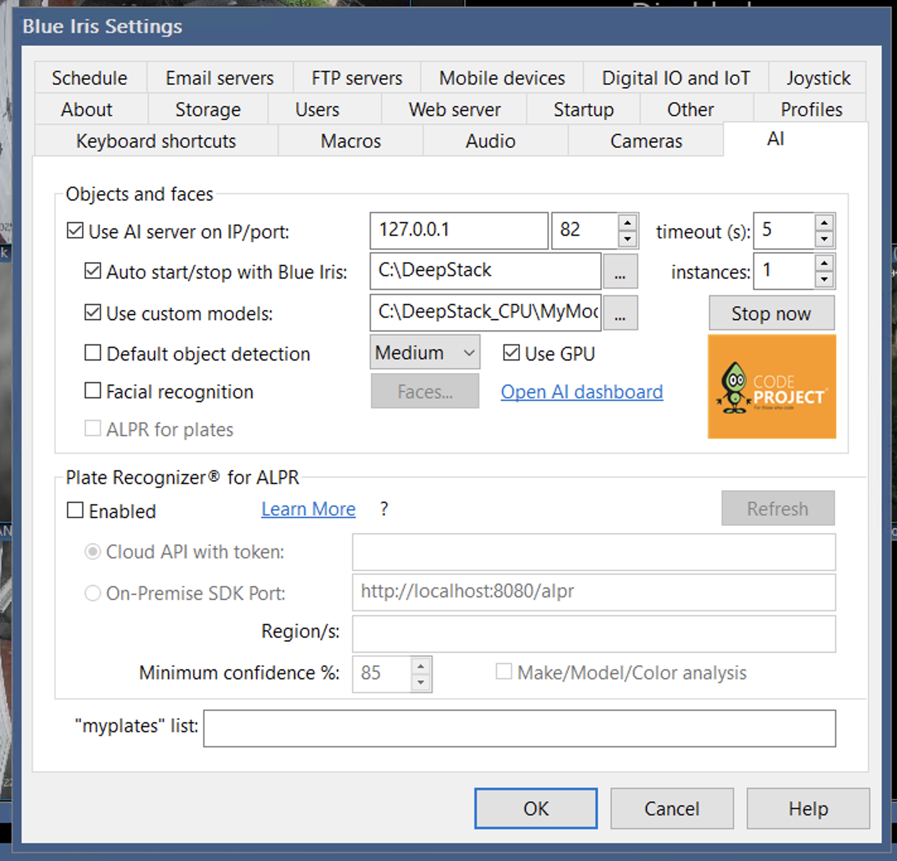

# Blue Iris → Telegram Alert System

Automated alert system that sends JPEG snapshots and fast-playback MP4 clips from Blue Iris to Telegram.

---

## ✅ Features
- Watches a folder for `.avi` and `.jpg` files created by Blue Iris alert events.
- Converts `.avi` alert videos to fast MP4s using FFmpeg (2x speed).
- Sends JPEGs and MP4s to a Telegram bot with optional captions and links.
- Deletes media files after successful upload.

---

## 📚 Setup Guide

### 1. Requirements
- [Python 3.10+](https://www.python.org/)
- [FFmpeg](https://ffmpeg.org/download.html) (added to system PATH)
- [Blue Iris](https://blueirissoftware.com/)
- Telegram bot + chat ID ([bot setup guide](https://core.telegram.org/bots#how-do-i-create-a-bot))

### 2. Folder Structure
- `C:\BlueIris\Telegram_Alerts_SSD` → Incoming `.avi` clips
- `C:\BlueIris\Telegram_Alerts_SSD_jpgs` → Incoming `.jpg` snapshots
- `C:\BlueIris\Scripts\logs` → Logs

### 3. Environment Variables (.env)
Create `.env` file in the script directory:
```env
TELEGRAM_BOT_TOKEN=your_bot_token_here
TELEGRAM_CHAT_ID=your_telegram_chat_id
```

---

## 🔧 Components

### Batch File: `convert_to_gif.bat`
```bat
@echo off
python C:\BlueIris\Scripts\convert_to_gif.py %1 %2 %3
```

> Add this in Blue Iris under Camera > Alerts > Post Trigger > Run program

### Python Script: `convert_to_gif.py`
- Reads JPEGs from `JPG_FOLDER` and uploads with clickable links
- Converts AVI to fast MP4 using FFmpeg
- Uploads via Telegram bot
- Deletes files after upload
- Logs actions and retries conversion if needed

> Full script saved in `C:\BlueIris\Scripts\convert_to_gif.py`

---

## 🔢 How It Works
1. Blue Iris triggers an alert.
2. `.jpg` snapshot saved to `Telegram_Alerts_SSD_jpgs`
3. `.avi` clip saved to `Telegram_Alerts_SSD`
4. Batch script calls Python script with alert info.
5. Script sends JPEGs and MP4s to Telegram.
6. Deletes media after upload.

---

## 📅 Example Usage
In Blue Iris > Camera Settings > Alerts:
- Post-trigger: `convert_to_gif.bat &ALERT_DB &NAME &PROFILE`

Telegram caption example:
```
[*Open Clip*](https://cctv.soldati.co.uk/ui3.htm?tab=alerts&rec=AlertDB123&maximize=1) \- Front Door
```

---

## 🚫 Notes
- FFmpeg must be in PATH. Test in CMD: `ffmpeg`
- Telegram bot file size limit is 50 MB
- MP4 is preferred over GIF due to Telegram compression

---

## 📸 Recommended Screenshots
| What                             | File Name Suggestion              |
|----------------------------------|-----------------------------------|
| Blue Iris post-trigger settings  | `bi_post_trigger_settings.png`    |
| Folder setup in File Explorer    | `folders_structure.png`           |
| Example `.env` config            | `env_example.png`                 |
| Telegram alert message result    | `telegram_alert_demo.png`         |

---

## ✨ Done!
This system now automates your Blue Iris alerts to Telegram smoothly with real-time clips and preview images. Enjoy peace of mind and quick access from anywhere.

### Camera 1: Record tab


### Camera 2: Record tab

### Camera 2: Record tab - Video file format and compression


### Camera 2: Trigger tab

Note the `Break time` section!



### Camera 2: Trigger tab - AI

### Camera 2: Trigger tab - AI - night



### Camera 2: Alerts tab


### Camera 2: Alerts tab - On alert...


### Camera 2: Alerts tab - Action


### Generic Settings: AI tab



